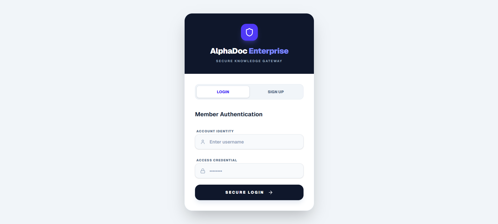

# AlphaDoc Enterprise: Document Intelligence Platform




> Use our live Vercel deployment to experience the platform now (Don’t forget to configure your Google API key and MongoDB URI, and index it using the JSON code provided in config tab.), or grab the source code from GitHub to start building your own end-to-end document intelligence system today."

**Live Application:** [AlphaDoc Enterprise on Vercel](https://document-understanding-and-summariz.vercel.app/)  
**Detailed Technical Blog:** [Read the full story on Medium](https://medium.com/@shaikhahmedfaraz64/alphadoc-enterprise-an-end-to-end-document-understanding-and-summarization-system-using-langchai-1f6bb3e323c8)

---

## 1. Introduction
AlphaDoc Enterprise is an end-to-end intelligent platform designed to automate document understanding.By leveraging state-of-the-art Large Language Models (LLMs) and specialized parsing techniques, it transforms static PDFs into a dynamic, queryable, and highly structured knowledge base.

## 2. Methodology: The Three-Stage Agile Pipeline
The development of AlphaDoc followed a modular, three-stage agile methodology to ensure high-fidelity extraction and contextual integrity.


### Stage 1: Ingestion Engine
Focused on high-fidelity ingestion that preserves document layout and hierarchy.
* **Layout-Aware Parsing:** Utilizes the `docling` library to convert raw PDFs into Markdown, maintaining vital structural cues like headers and tables.
* **Recursive Segmenting:** Documents are split into logical sections based on header hierarchy (e.g., #, ##, ###).
* **Overlapping Chunking:** Large sections are refined using a `RecursiveCharacterTextSplitter` with a chunk size of 1500 and 150-character overlap to prevent context loss.

### Stage 2: Intelligence Layer
Extracts deep semantic intelligence using specialized prompt schemas and Pydantic models.
* **Structured Extraction:** Forces the LLM to output granular data including Named Entity Recognition (NER), relationship mapping, and actionable insights.
* **Multi-Tier Summaries:** Generates Executive Overviews for decision-makers, Technical Decompositions for engineers, and Section-wise summaries.

### Stage 3: Interactive RAG
Enables natural language interaction with the document repository.
* **Vector Storage:** Chunks are embedded using `text-embedding-004` and stored in MongoDB Atlas with rich metadata.
* **Self-Query Retriever:** Translates natural language queries into structured metadata filters for precise retrieval.

## 3. Multi-Tenant Enterprise Architecture
Designed as a scalable, web-based enterprise solution where each organization is isolated.
* **Tenant Isolation:** Users are associated with specific workspaces, allowing for private API keys and dedicated MongoDB Atlas clusters.
* **Audit Trail:** Every action (Login, Upload, Search) is recorded with timestamps and operator details for security and compliance.


## 4. Technology Stack
* **Backend:** FastAPI (Python)
* **Frontend:** Next.js / React (TypeScript)
* **AI/NLP:** Google Gemini API, LangChain, Docling
* **Database:** MongoDB Atlas (Multi-tenant)
* **Deployment:** Docker, Hugging Face Spaces (Backend), Vercel (Frontend)

---

## 5. Local Setup & Configuration

### Prerequisites
* Python 3.12+
* Node.js 24.13.0+
* MongoDB Atlas Account

### Backend Configuration
1. Clone the repository and navigate to the backend folder.
2. Create a `.env` file and add the following:
   ```env
   MONGODB_URI=your_mongodb_connection_string
   SECRET_KEY=your_secure_jwt_secret
   GOOGLE_API_KEY=your_gemini_api_key
3. Install dependencies: pip install -r requirements.txt
4. Run the server: uvicorn main:app --port 8000

### Frontend Configuration
1. Navigate to the frontend folder.
2. Create a .env.local file:
    ```env
    NEXT_PUBLIC_API_BASE=http://localhost:8000

3. Install dependencies: npm install
4. Run the development server: npm run dev


### Database Indexing
Note: When using app don't forget to configure your Google API key and MongoDB URI, and index your collection using the JSON configuration provided in the config tab of app.